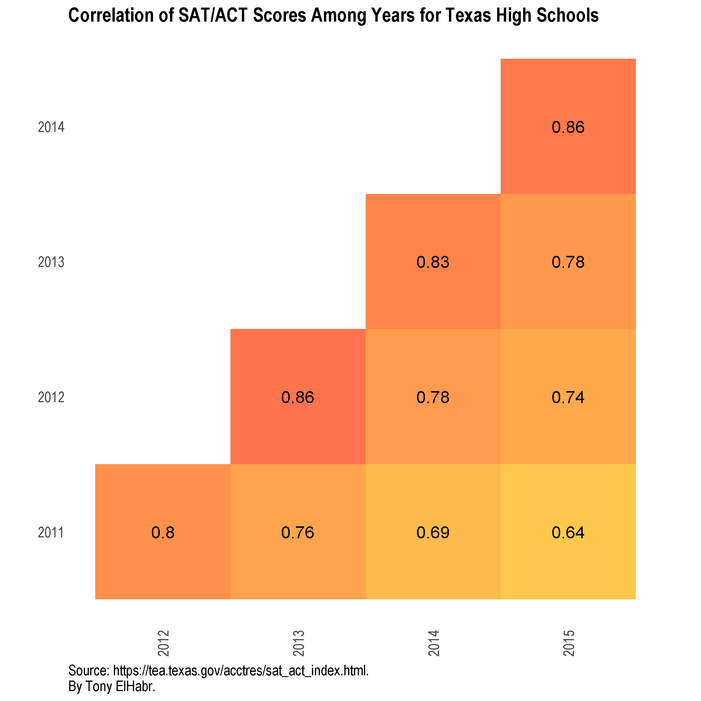
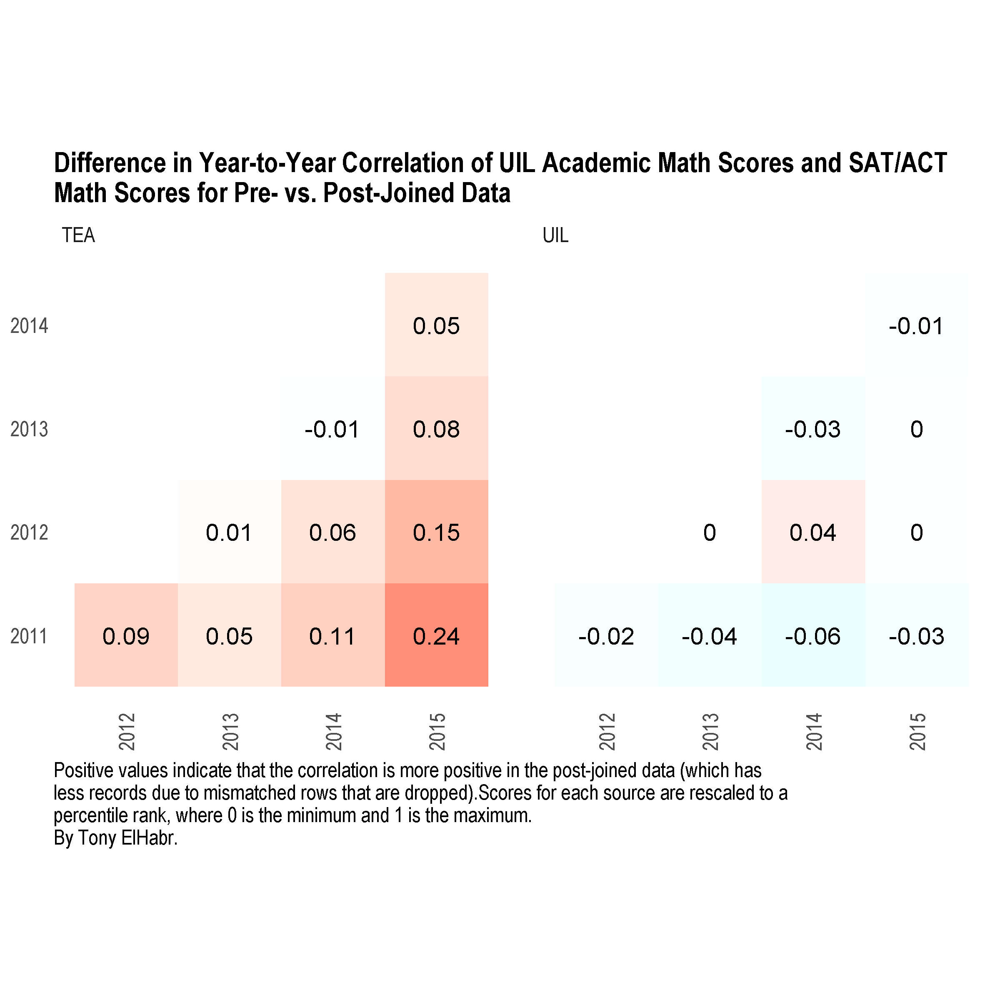

Introduction
============

See my blog posts (to be linked here) for the full write-ups, or, check out the `.html` file(s) in the `output/` directory in this repo, which was used as the basis for the blog post. The `figs/` directory also contains some of the visualizations in the post.

The documents can be recreated with the following commands:

``` r
rmarkdown::render("R/01-report.Rmd", output_dir = "output", intermediates_dir = "output")
```

Highlights
==========

Here are a couple of the coolest visualizations, in my opinion.





